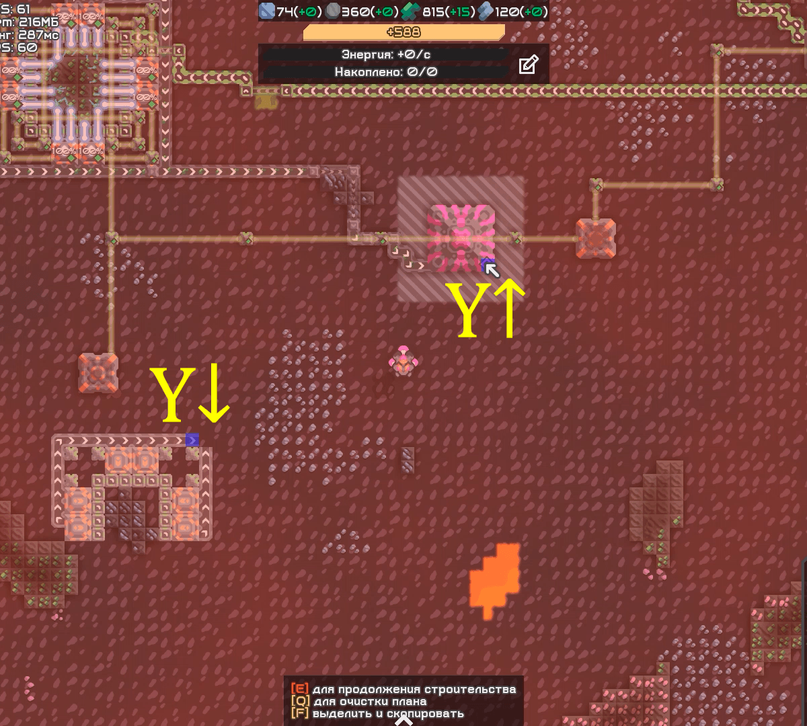

# Machindustry

This mod is focused on the quality of the game in PvP mode on the planet Erekir. It is not intended for mobile devices.

## Features

The following features are currently implemented:  
- Finding path for items  
- Finding path for liquids  
- Finding path for beam nodes  
- Connecting turbine condensers in the map area to the main power net

## Settings

### Ground units evaluation

Currently ground units are not evaluated when pathing so it is your responsibility to remove them from the path before building it.

### Polygon protection safe zone

When core polygon protection map rule is enabled, player can see polygon edges between cores when holding building. Player can not build anything on given tile if closest core to this tile is not player's team core. Pathing algorithm must keep in mind these edges to build paths right. However, its calculated edges do not always match exactly with game's calculated edges because game is calculating distances for each individual pair core-tile when player tries to place building, but pathing algorithm have to calculate all available pairs on map before it can start pathing, so it uses faster and simplified way to do it. This setting adds one extra tile to polygon edges to reduce the chance of edges dismatch.

### Radius protection safe zone

When core radius protection map rule is enabled, player can see circle edges around enemy cores when holding building. Player can not build anything on given tile if distance between any enemy core and this tile is not bigger than given distance R (can be changed in map rules). However, distance calculation details lead to non-symmetric allowed distances to cores (watch the video below, liquid tanks around afflict), so this setting adds one extra tile (by default) to given distance R when calculating what tiles algorithm can path to reduce the chance of distances dismatch.

### Target mode

## Usage

